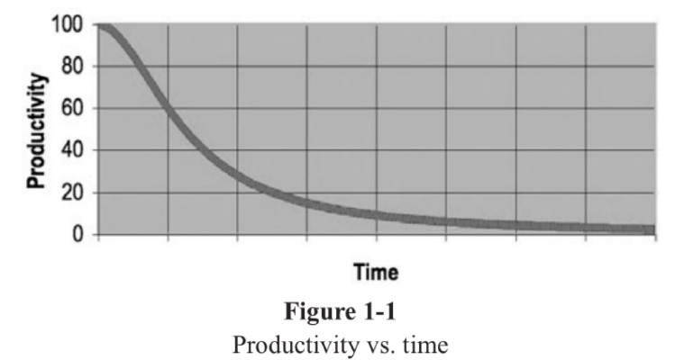
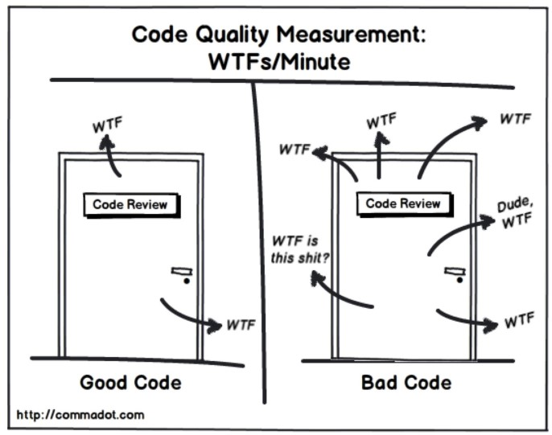

# Conventions d'équipe

## Pourquoi du code de qualité ?
-	Au fur et à mesure que le désordre augmente, la productivité tend vers 0 
-	Un développeur passe 10 fois plus de temps à lire du code qu’à en écrire 
-	Les conséquences du code sale se manifestent progressivement 
-	Notre ennemi numéro 1 en informatique : la complexité inutilement accumulée



## Meilleure métrique pour mesurer de la qualité du code : WTFs/Minute

* WTF : Acronyme anglais pour « C’est quoi ce bazard !!? »

## Qu’est-ce que du code sale ?
-	Un marécage où on se perd
-	Aussi loin qu’on avance à la recherche d’un indice, 
tout ce que l’on voit c’est du code sans signification
-	Du code sans structure
-	Du code dupliqué
-	Un patchwork 1000 fois reprisé
-	Complexité inutile
-	Structures de données mal adaptées au besoin
-	Commentaires inappropriés

## Qu’est-ce que du code propre ?
-	Ce qui se conçoit bien s’énonce clairement et les mots pour le dire viennent aisément. Nicolas Boileau 
-	Si vous n'êtes pas capable d'expliquer quelque chose à un enfant de 6 ans, c'est que vous ne le comprenez pas vous-même. Einstein
-	Il semble que la perfection soit atteinte non quand il n'y a plus rien à ajouter, mais quand il n'y a plus rien à retirer. St Exupéry
### Lisible
- Se lit comme une phrase. Les abstractions sont nettes, les chemins d’exécution évidents.
- Qu’est ce qui est le plus facile à lire ?
```c#
public List<int[]> getThem(List<int[]> theList){
  List<int[]> list1 = new ArrayList<int[]>();
  foreach (int[] x in theList)
     if (x[0] == 4)
       list1.Add(x);
  return list1;
}
```
```c#
public List<Cell> getFlaggedCells(List<Cell> gameBoard){
  List<Cell> flaggedCells = new ArrayList<Cell>();
  foreach (Cell cell in gameBoard)
    if (cell.isFlagged())
      flaggedCells.Add(cell);
  return flaggedCells;
}
```
```c#
public List<Cell> getFlaggedCells(List<Cell> gameBoard){
  return gameBoard.Where(cell => cell.isFlagged());
}
```
### Élégant
- Assez simple et direct pour ne pas laisser de place aux bugs.
### Facile à modifier
- Peut être modifié par un autre que son auteur, utilise un nommage explicite et expressif.
### Écrit avec soin
- Aucun problème évident ne saute aux yeux.
### Sans surprise
- Le corps des méthodes est ce que l’on avait deviné
## La règle du Boy Scout
- Laisser le code source plus propre que ce que vous l’avez trouvé.
## Qu’est-ce que du design sale ?
### Rigide
- Les changements simples doivent être propagés dans beaucoup de modules dépendants ; ce qui rend les changements simples fastidieux.
### Fragile
- Un petit changement cause beaucoup d’effets de bords. Par peur de modifier et casser, on patche ce qui entraîne de nouveaux effets de bords.
### Immobile
- Réutiliser du code nécessite trop d’effort et de risque à cause des dépendances,  alors on copie-colle…
### Visceux
- Lors d’un changement à effectuer, nous sommes face au dilemme suivant : devons-nous préserver l’architecture en place et perdre du temps ou prendre des raccourcis et gagner du temps ? 
### Inutilement Complexe
- La conception contient des éléments non utiles, souvent dans le but d’éviter les autres problèmes de design (abstractions non utiles par anticipation).
### Contient de la duplication inutile
- Ici, on est dans la POCC (Programmation Orienté Copier-Coller). De l’abstraction ou de la composition aurait dû être faite. 
### Opaque
- Le code est difficile à comprendre. Beaucoup de temps est investi en « reverse engineering » pour le comprendre et/ou les modifications de code introduisent des bugs dues à la non-compréhension.
## Principes élémentaires pour du design propre 
### Garde ça stupidement simple ! (KISS)
-	Toute complexité non indispensable devrait être évitée. 
-	Ne pas optimiser quoi que ce soit avant de maîtriser totalement une version simple de ce que l'on crée.
-	Notre ennemi numéro 1 en informatique : la complexité !
### Vous n’en aurez pas besoin ! (YAGNI)
- Mettez toujours en œuvre les choses quand vous en avez effectivement besoin, pas lorsque vous prévoyez simplement que vous en aurez besoin.
### Ne vous répétez pas (DRY)
- Toute connaissance doit avoir une représentation unique, non-ambiguë, faisant autorité.
## Principes plus avancés de design propre (Jedi)
### Programmation Orienté Objet (POO)
2 outils fournis par la POO pour attaquer la complexité : la composition et l’abstraction. L’abstraction est souvent surutilisée au détriment de la composition. 
Abstraction : « Des objets se comportent presque pareil »
Composition : Des tâches similaires sont déléguées à un objet fils (ex : logger, publisher). 
### Principes SOLID
Les principes SOLID nous aident à exploiter la POO et nous guide vers une architecture modulaire : Le code s’assemble comme des blocs LEGO.
### Principes GRASP
Les principes GRASP mettent un focus sur les responsabilités d’un composant, qu’est-ce qui doit être mis où. Le résumé serait « Chaque chose a sa place et chaque place a sa chose ».

# Lean Canvas

The Lean Canvas is a version of the Business Model Canvas adapted by Ash Maurya specifically for startups. You can read more about it [here](http://leanstack.com/why-lean-canvas/).

<table>
  <tr>
    <td rowspan="2">

## Pourquoi du code de qualité ?
-	Au fur et à mesure que le désordre augmente, la productivité tend vers 0 
-	Un développeur passe 10 fois plus de temps à lire du code qu’à en écrire 
-	Les conséquences du code sale se manifestent progressivement 
-	Notre ennemi numéro 1 en informatique : la complexité inutilement accumulée


## Meilleure métrique pour mesurer de la qualité du code : WTFs/Minute

* WTF : Acronyme anglais pour « C’est quoi ce bazard !!? »

    </td>
    <td>
      
## Qu’est-ce que du code sale ?
-	Un marécage où on se perd
-	Aussi loin qu’on avance à la recherche d’un indice, 
tout ce que l’on voit c’est du code sans signification
-	Du code sans structure
-	Du code dupliqué
-	Un patchwork 1000 fois reprisé
-	Complexité inutile
-	Structures de données mal adaptées au besoin
-	Commentaires inappropriés

## Qu’est-ce que du code propre ?
-	Ce qui se conçoit bien s’énonce clairement et les mots pour le dire viennent aisément. Nicolas Boileau 
-	Si vous n'êtes pas capable d'expliquer quelque chose à un enfant de 6 ans, c'est que vous ne le comprenez pas vous-même. Einstein
-	Il semble que la perfection soit atteinte non quand il n'y a plus rien à ajouter, mais quand il n'y a plus rien à retirer. St Exupéry
### Lisible
- Se lit comme une phrase. Les abstractions sont nettes, les chemins d’exécution évidents.
- Qu’est ce qui est le plus facile à lire ?
```c#
public List<int[]> getThem(List<int[]> theList){
  List<int[]> list1 = new ArrayList<int[]>();
  foreach (int[] x in theList)
     if (x[0] == 4)
       list1.Add(x);
  return list1;
}
```
```c#
public List<Cell> getFlaggedCells(List<Cell> gameBoard){
  List<Cell> flaggedCells = new ArrayList<Cell>();
  foreach (Cell cell in gameBoard)
    if (cell.isFlagged())
      flaggedCells.Add(cell);
  return flaggedCells;
}
```
```c#
public List<Cell> getFlaggedCells(List<Cell> gameBoard){
  return gameBoard.Where(cell => cell.isFlagged());
}
```
### Élégant
- Assez simple et direct pour ne pas laisser de place aux bugs.
### Facile à modifier
- Peut être modifié par un autre que son auteur, utilise un nommage explicite et expressif.
### Écrit avec soin
- Aucun problème évident ne saute aux yeux.
### Sans surprise
- Le corps des méthodes est ce que l’on avait deviné
## La règle du Boy Scout
- Laisser le code source plus propre que ce que vous l’avez trouvé.
      
    </td>
    <td rowspan="2" colspan="2">
      <b>Unique Value Proposition</b>
      <p>Single, clear, <br>
      compelling message <br>
      that states why you <br>
      are different and <br>
      worth paying <br>
      attention</p>
      <br><br><br><br><br>
    </td>
    <td>
      <b>Unfair Advantage</b>
      <p>Can't be easily <br>
      copied or bought</p>
    </td>
    <td rowspan="2">
      <b>Customer Segments</b>
      <p>Target customers</p>
    </td>
  </tr>
 
</table>
